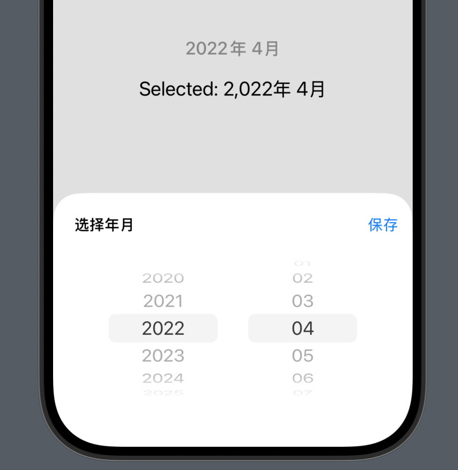

# MonthYearPickerKit
轻量级 SwiftUI 月份选择器组件包，适用于记账、报表、计划类应用中的年月筛选。



## ✨ 特性亮点

- 🧭 支持年/月切换，默认当前年月
- 🔄 实时更新选择的年月

## 🚀 使用方法
```swift
import SwiftUI
import MonthYearPickerKit

struct MonthYearPickerDemo: View {
    @State private var selectedYear: Int = Calendar.current.component(.year, from: Date())
    @State private var selectedMonth: Int = Calendar.current.component(.month, from: Date())

    var body: some View {
        VStack(spacing: 20) {
            MonthYearPicker(
                yearRange: 2020...2030,
                onChange: { year, month in
                    selectedYear = year
                    selectedMonth = month
                }
            )
            
            Text("Selected: \(selectedYear)年 \(selectedMonth)月")
                .font(.title2)
        }
        .padding()
    }
}

#Preview {
    MonthYearPickerDemo()
}
```
